# OmniPass: AI-Powered Cross-Chain Reputation Protocol

[](https://www.zetachain.com/)
[](https://cloud.google.com/)
[](https://opensource.org/licenses/MIT)

**Live Demo:** [Coming Soon](https://omnipass.xyz)  
**Submission for the ZetaChain x Google Cloud Buildathon**

OmniPass is a revolutionary cross-chain reputation protocol that leverages AI to analyze DeFi activity across multiple blockchains, generating comprehensive, non-transferable credentials that unlock personalized Web3 experiences.

---

## 📋 Table of Contents

- [🎯 The Problem](#-the-problem)
- [💡 The Solution](#-the-solution)
- [🏗️ System Architecture](#️-system-architecture)
- [🔄 User Flow](#-user-flow)
- [✨ Core Features](#-core-features)
- [🛠️ Technology Stack](#️-technology-stack)
- [🚀 Getting Started](#-getting-started)
- [📁 Project Structure](#-project-structure)
- [📜 Smart Contract Details](#-smart-contract-details)
- [🔗 API Documentation](#-api-documentation)
- [🎪 Hackathon Submission](#-hackathon-submission)
- [🗺️ Future Roadmap](#️-future-roadmap)
- [🤝 Contributing](#-contributing)
- [📄 License](#-license)

---

## 🎯 The Problem

In today's multi-chain DeFi ecosystem, user reputation is severely fragmented:

```mermaid
graph TD
    A[DeFi User] --> B[Ethereum Activity]
    A --> C[Polygon Activity]
    A --> D[BSC Activity]
    A --> E[Other Chains...]
    
    B -.-> F[Isolated Reputation]
    C -.-> G[Isolated Reputation]
    D -.-> H[Isolated Reputation]
    E -.-> I[Isolated Reputation]
    
    F --> J[❌ No Cross-Chain Visibility]
    G --> J
    H --> J
    I --> J
    
    J --> K[Missed Opportunities]
    J --> L[Poor Risk Assessment]
    J --> M[Limited Protocol Access]
```



**Key Issues:**
- ❌ DeFi power users on one chain appear as unknowns on others
- ❌ Protocols can't accurately assess user experience and risk
- ❌ Users can't leverage their full on-chain reputation
- ❌ Limited access to tier-based benefits across ecosystems

---

## 💡 The Solution

OmniPass creates a unified, AI-powered reputation system that transcends blockchain boundaries:


---

## 🏗️ System Architecture


### Component Breakdown

| Component | Technology | Purpose |
|-----------|------------|---------|
| **Frontend** | React + TypeScript + Vite | User interface and Web3 interactions |
| **Backend** | Node.js + Express | API layer and business logic |
| **AI Engine** | Google Gemini | Intelligent analysis and coaching |
| **Blockchain** | ZetaChain Universal Contracts | Cross-chain credential management |
| **Data Layer** | Alchemy API | Multi-chain data aggregation |

---

## 🔄 User Flow

### Primary User Journey


### Credential Verification Flow


---

## ✨ Core Features

### 🔗 Cross-Chain Analysis
- **Multi-Chain Data Aggregation**: Ethereum, Polygon, ZetaChain, and expanding
- **Protocol Integration**: Support for major DeFi protocols (Uniswap, Aave, Compound, etc.)
- **Real-Time Updates**: Continuous monitoring of user activity

### 📊 Reputation Scoring System


| Metric | Weight | Description |
|--------|--------|-------------|
| **Risk Score** | 30% | Based on lending health factors, liquidation history |
| **Activity Level** | 25% | Transaction frequency, total volume, time active |
| **Diversification** | 25% | Number of protocols used, asset variety |
| **Experience** | 20% | Protocol complexity, advanced feature usage |

### 🤖 AI-Powered Insights
- **Behavioral Analysis**: Pattern recognition in DeFi usage
- **Risk Assessment**: Intelligent evaluation of user's risk profile
- **Personalized Recommendations**: Tailored advice for portfolio optimization
- **Market Insights**: AI-driven analysis of user's position in current market

### 🎯 Tier-Based Access System


### 💬 AI DeFi Coach
- **24/7 Availability**: Always-on AI assistant powered by Gemini
- **Contextual Advice**: Responses based on user's actual on-chain activity
- **Strategy Recommendations**: Personalized DeFi strategies
- **Risk Management**: Proactive warnings and suggestions

---

## 🛠️ Technology Stack

### Frontend Stack
```
React 18.x
├── TypeScript 5.x
├── Vite 4.x (Build tool)
├── TailwindCSS 3.x (Styling)
├── Wagmi 2.x (Web3 hooks)
├── Framer Motion (Animations)
└── Lucide React (Icons)
```

### Backend Stack
```
Node.js 18.x
├── Express.js 4.x
├── TypeScript 5.x
├── Google Gemini API
├── Alchemy SDK
├── Web3.js/Ethers.js
└── CORS & Security Middleware
```

### Blockchain Stack
```
Solidity ^0.8.19
├── ZetaChain Universal Contracts
├── OpenZeppelin Libraries
├── Hardhat (Development)
└── Cross-chain Messaging
```

### Infrastructure
```
Deployment
├── Frontend: Vercel
├── Backend: Google Cloud Run
├── Database: Google Firestore (optional)
└── Monitoring: Google Cloud Logging
```

---

## 🚀 Getting Started

### Prerequisites

Ensure you have the following installed:
- **Node.js** v18 or higher
- **npm** or **yarn**
- **Git**
- **MetaMask** or compatible Web3 wallet

### 📦 Installation

1. **Clone the repository:**
```bash
git clone https://github.com/your-username/omnipass.git
cd omnipass
```

2. **Install dependencies for all modules:**
```bash
# Install frontend dependencies
cd frontend
npm install

# Install backend dependencies
cd ../backend
npm install

# Install smart contract dependencies
cd ../contracts
npm install
```

### ⚙️ Configuration

Create environment files for each component:

#### Backend Configuration (`.env`)
```env
# Blockchain Data
ALCHEMY_API_KEY=your_alchemy_api_key
ETHEREUM_RPC_URL=https://eth-mainnet.g.alchemy.com/v2/YOUR-API-KEY
POLYGON_RPC_URL=https://polygon-mainnet.g.alchemy.com/v2/YOUR-API-KEY

# AI Services
GEMINI_API_KEY=your_gemini_api_key
GEMINI_MODEL=gemini-pro

# ZetaChain Configuration
ZETACHAIN_RPC_URL=https://zetachain-evm.blockpi.network/v1/rpc/public
ZETACHAIN_PRIVATE_KEY=your_private_key_for_deployment

# Server Configuration
PORT=3001
CORS_ORIGIN=http://localhost:3000

# Optional: Database
FIRESTORE_PROJECT_ID=your_project_id
```

#### Frontend Configuration (`.env`)
```env
VITE_BACKEND_URL=http://localhost:3001
VITE_ZETACHAIN_CONTRACT_ADDRESS=0x...
VITE_SUPPORTED_CHAINS=1,137,7000 # Ethereum, Polygon, ZetaChain
```

#### Smart Contracts Configuration (`.env`)
```env
PRIVATE_KEY=your_private_key
ALCHEMY_API_KEY=your_alchemy_api_key
ETHERSCAN_API_KEY=your_etherscan_api_key
```

### 🏃‍♂️ Running the Application

1. **Start the backend server:**
```bash
cd backend
npm run dev
```
The backend will start on `http://localhost:3001`

2. **Deploy smart contracts (optional for development):**
```bash
cd contracts
npx hardhat run scripts/deploy.js --network zetachain-testnet
```

3. **Start the frontend:**
```bash
cd frontend
npm run dev
```
The frontend will start on `http://localhost:3000`

### 🧪 Running Tests

```bash
# Run backend tests
cd backend
npm test

# Run smart contract tests
cd contracts
npx hardhat test

# Run frontend tests
cd frontend
npm test
```

---

## 📁 Project Structure

```
omnipass/
├── 📁 backend/                    # Node.js/Express backend
│   ├── 📁 src/
│   │   ├── 📁 controllers/        # API route controllers
│   │   ├── 📁 services/           # Core business logic
│   │   │   ├── 📄 AnalysisEngine.ts    # Cross-chain data analysis
│   │   │   ├── 📄 GeminiService.ts     # AI integration
│   │   │   ├── 📄 BlockchainService.ts # Web3 interactions
│   │   │   └── 📄 CredentialManager.ts # Credential management
│   │   ├── 📁 routes/             # API endpoints
│   │   ├── 📁 middleware/         # Express middleware
│   │   ├── 📁 utils/              # Utility functions
│   │   └── 📄 index.ts            # Server entry point
│   ├── 📄 package.json
│   └── 📄 .env.example
├── 📁 contracts/                  # Solidity smart contracts
│   ├── 📁 contracts/
│   │   ├── 📄 OmniPassCredential.sol   # Main Universal Contract
│   │   ├── 📄 interfaces/              # Contract interfaces
│   │   └── 📄 libraries/               # Shared libraries
│   ├── 📁 scripts/                # Deployment scripts
│   ├── 📁 test/                   # Contract tests
│   ├── 📄 hardhat.config.js
│   └── 📄 package.json
├── 📁 frontend/                   # React/Vite frontend
│   ├── 📁 public/                 # Static assets
│   ├── 📁 src/
│   │   ├── 📁 components/         # React components
│   │   │   ├── 📁 ui/             # Base UI components
│   │   │   ├── 📄 Dashboard.tsx   # Main dashboard
│   │   │   ├── 📄 AIChat.tsx      # AI coach interface
│   │   │   └── 📄 CredentialCard.tsx # Credential display
│   │   ├── 📁 hooks/              # Custom React hooks
│   │   ├── 📁 pages/              # Route pages
│   │   ├── 📁 services/           # API client
│   │   ├── 📁 utils/              # Frontend utilities
│   │   ├── 📁 types/              # TypeScript types
│   │   ├── 📄 App.tsx             # Main app component
│   │   └── 📄 main.tsx            # React entry point
│   ├── 📄 package.json
│   ├── 📄 vite.config.ts
│   └── 📄 tailwind.config.js
├── 📁 docs/                       # Documentation
├── 📄 README.md                   # This file
├── 📄 LICENSE
└── 📄 .gitignore
```

---

## 📜 Smart Contract Details

### OmniPassCredential.sol - Universal Contract Architecture

```solidity
contract OmniPassCredential is 
    UniversalContract, 
    ERC721, 
    Ownable, 
    ReentrancyGuard 
{
    // Core structures
    struct Credential {
        address holder;
        Tier tier;
        uint256 riskScore;
        uint256 activityScore;
        uint256 diversificationScore;
        bytes32 dataHash;
        uint256 issuedAt;
        uint256 expiresAt;
        bool isActive;
    }
    
    enum Tier { BRONZE, SILVER, GOLD, PLATINUM }
    
    // State variables
    mapping(address => Credential) public credentials;
    mapping(Tier => TierRequirements) public tierRequirements;
    
    // Events
    event CredentialIssued(address indexed holder, Tier tier);
    event CredentialRevoked(address indexed holder);
    event TierUpgraded(address indexed holder, Tier newTier);
}
```

### Key Contract Functions

| Function | Purpose | Access Control |
|----------|---------|----------------|
| `issueCredential()` | Create new OmniPass credential | Authorized issuers only |
| `verifyCredential()` | Check credential validity | Public view |
| `upgradeTier()` | Upgrade user to higher tier | Authorized issuers only |
| `revokeCredential()` | Revoke compromised credentials | Owner/user only |
| `onCrossChainCall()` | Handle cross-chain requests | ZetaChain protocol |

### Tier Requirements


---

## 🔗 API Documentation

### Authentication
All API requests require a valid Ethereum signature for wallet verification.

### Core Endpoints

#### GET `/api/analysis/:address`
Get comprehensive analysis for a wallet address.

**Response:**
```json
{
  "address": "0x...",
  "totalTVL": 125000,
  "riskScore": 85,
  "activityScore": 78,
  "diversificationScore": 82,
  "tier": "GOLD",
  "insights": {
    "summary": "Experienced DeFi user with strong risk management...",
    "recommendations": [...],
    "riskFactors": [...]
  },
  "chainData": {
    "ethereum": {...},
    "polygon": {...}
  }
}
```

#### POST `/api/credentials/issue`
Issue a new OmniPass credential.

**Request:**
```json
{
  "address": "0x...",
  "analysisData": {...},
  "signature": "0x..."
}
```

#### GET `/api/credentials/:address`
Retrieve credential information.

#### POST `/api/chat`
Interact with AI DeFi coach.

**Request:**
```json
{
  "message": "How can I improve my DeFi portfolio?",
  "address": "0x...",
  "context": {...}
}
```

### WebSocket Events
- `analysis_progress` - Real-time analysis updates
- `credential_updated` - Credential status changes
- `ai_response` - AI coach responses

---

## 🎪 Hackathon Submission

### ZetaChain x Google Cloud Buildathon Alignment

**ZetaChain Integration:**
- ✅ **Universal Smart Contract**: Core credential management
- ✅ **Cross-Chain Messaging**: Seamless multi-chain interactions  
- ✅ **Omnichain dApps**: Unified experience across all chains

**Google Cloud Integration:**
- ✅ **Gemini AI**: Sophisticated analysis and coaching
- ✅ **Cloud Run**: Scalable backend deployment
- ✅ **AI-First Approach**: Intelligent reputation assessment

### Innovation Highlights

1. **Novel Use Case**: First cross-chain reputation system using AI
2. **Technical Excellence**: Combines cutting-edge blockchain and AI tech
3. **User Experience**: Intuitive interface with personalized AI guidance
4. **Scalability**: Built for multi-chain future of Web3
5. **Real Utility**: Immediate benefits for users and protocols

---

## 🗺️ Future Roadmap

### Phase 1: Foundation (Q1 2024) ✅
- [x] Core protocol development
- [x] ZetaChain Universal Contract deployment
- [x] Basic AI integration with Gemini
- [x] Frontend MVP

### Phase 2: Expansion (Q2 2024)
- [ ] **Multi-Chain Support**: Add Arbitrum, Optimism, BSC
- [ ] **Protocol Partnerships**: Integrate with major DeFi protocols
- [ ] **Advanced AI Features**: Predictive analytics, market insights
- [ ] **Mobile App**: Native iOS/Android applications

### Phase 3: Ecosystem (Q3 2024)
- [ ] **Developer SDK**: Tools for easy OmniPass integration
- [ ] **Governance Token**: Community-driven protocol evolution
- [ ] **Institutional Features**: Enterprise-grade analytics
- [ ] **Cross-Protocol Benefits**: Exclusive access and rewards

### Phase 4: Innovation (Q4 2024)
- [ ] **Privacy Layer**: Zero-knowledge credential verification
- [ ] **Decentralized Oracles**: Community-driven data validation
- [ ] **AI Model Training**: User-contributed data for better insights
- [ ] **Metaverse Integration**: Reputation in virtual worlds

---

## 🤝 Contributing

We welcome contributions from the community! Here's how you can help:

### Development Setup

1. **Fork the repository**
2. **Create a feature branch**: `git checkout -b feature/amazing-feature`
3. **Install dependencies**: Follow the getting started guide
4. **Make changes**: Implement your feature
5. **Test thoroughly**: Ensure all tests pass
6. **Commit changes**: `git commit -m 'Add amazing feature'`
7. **Push to branch**: `git push origin feature/amazing-feature`
8. **Open a Pull Request**: Describe your changes

### Contribution Guidelines

- **Code Style**: Follow TypeScript/Solidity best practices
- **Testing**: Include tests for new features
- **Documentation**: Update docs for any API changes
- **Commits**: Use conventional commit messages

### Areas for Contribution

- 🔗 **New Chain Integrations**: Add support for more blockchains
- 🤖 **AI Improvements**: Enhance analysis algorithms
- 🎨 **UI/UX**: Improve user interface and experience  
- 📚 **Documentation**: Expand guides and tutorials
- 🧪 **Testing**: Increase test coverage
- 🔐 **Security**: Security audits and improvements

---

## 📄 License

This project is licensed under the MIT License. See the [LICENSE](LICENSE) file for details.

```
MIT License

Copyright (c) 2024 OmniPass Team

Permission is hereby granted, free of charge, to any person obtaining a copy
of this software and associated documentation files (the "Software"), to deal
in the Software without restriction, including without limitation the rights
to use, copy, modify, merge, publish, distribute, sublicense, and/or sell
copies of the Software, and to permit persons to whom the Software is
furnished to do so, subject to the following conditions...
```

---

## 📞 Contact & Support

- **Website**: [omnipass.xyz](https://omnipass.xyz)
- **GitHub**: [github.com/omnipass-protocol](https://github.com/omnipass-protocol)
- **Twitter**: [@OmniPassHQ](https://twitter.com/OmniPassHQ)
- **Discord**: [OmniPass Community](https://discord.gg/omnipass)
- **Email**: team@omnipass.xyz

### Community

Join our growing community of developers, users, and DeFi enthusiasts:

- 💬 **Discord**: Daily discussions and support
- 🐦 **Twitter**: Latest updates and announcements  
- 📝 **Blog**: Technical deep-dives and tutorials
- 🎥 **YouTube**: Video guides and demos

---

**Built with ❤️ for the future of cross-chain DeFi**
